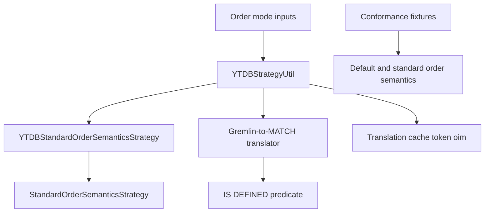

# Gremlin global order and missing sort keys — Architecture Decision Record

## Summary

Gremlin is the Apache TinkerPop graph traversal language. A global Gremlin `order()` step
silently dropped a record when the record lacked its sort key.

YouTrackDB now keeps that record by default. YouTrackDB gives the missing sort key a null value.
Native Gremlin execution and translated execution use the same effective mode.

Result membership agrees except for an accepted translated-path fan-in limitation. An indexed sort
on a fan-in target can lose duplicate rows. The [shipped order guide][order-guide-limitation]
describes the limitation and available workarounds.

Standard order semantics preserve the earlier Apache TinkerPop behavior. Standard order semantics
remove a record when its sort-key traversal produces no value.

## Goals

- Keep records with missing sort keys during global ordering by default.
- Align native and translated result membership outside the accepted fan-in limitation.
- Offer standard order semantics through configuration and a traversal strategy.
- Prevent translation cache entries from crossing order modes.
- Run Apache TinkerPop conformance coverage in both supported modes.
- Use one term, standard order semantics, for the record-removal behavior.

## Constraints

- YouTrackDB depends on its Apache TinkerPop fork.
- The fork version is `3.8.1-e3acec5-SNAPSHOT`.
- The fork group identifier is `io.youtrackdb`.
- The `central-portal-snapshots` repository publishes the fork snapshot.
- `pom.xml` line 114 selects the fork version.
- Local-scope ordering keeps its filtering behavior permanently.
- The translator must preserve its existing all-or-nothing fallback.

## Architecture Notes

### Component Map

The Gremlin-to-MATCH translator converts recognized Gremlin traversals into YouTrackDB Query
Language MATCH plans. MATCH is the graph-pattern query form in the YouTrackDB Query Language.

### Decision Records

#### D1: Keep a missing sort key by default

Global ordering now keeps a record when the sort-key traversal produces no value. The missing key
becomes a null sort value. Ascending order puts the null value first. Descending order puts the null
value last. The [shipped order guide][order-guide-placement] documents this placement.

Standard order semantics remove that record. Local-scope ordering continues to remove a record
whose sort key is missing. The disagreement with global ordering is permanent and intended.

#### D2: Resolve both mode inputs in `YTDBStrategyUtil`

The `orderIncludesMissingKey` setting is the first input. A server default, database override, or
per-traversal override can supply the setting.

A user-supplied `StandardOrderSemanticsStrategy` is the second input. The strategy can only select
standard order semantics.

`YTDBStrategyUtil` owns the one-way combination rule. A false setting or the user strategy selects
standard order semantics.

The one-way rule prevents strategy application order from changing the result. An unresolved
setting keeps records, which matches the server default.

#### D3: Reject one contradictory per-traversal request

An explicit per-traversal `orderIncludesMissingKey=true` option conflicts with a user-supplied
`StandardOrderSemanticsStrategy`. YouTrackDB raises a dedicated contradiction error.

The error prevents two explicit instructions from hiding the record-loss choice. The error also
recommends removing the strategy from the traversal source.

A deployment-wide setting does not raise this error. The user strategy is a narrower instruction
and can select standard order semantics for one traversal source.

#### D4: Delegate native record removal to the fork

The native YouTrackDB strategy is named `YTDBStandardOrderSemanticsStrategy`. The name replaces the
former native strategy name.

When configuration selects standard order semantics, the native strategy delegates to
`StandardOrderSemanticsStrategy.instance().apply(traversal)`. A user-supplied
`StandardOrderSemanticsStrategy` applies itself. The fork therefore owns order-step selection and
filtering-state changes.

#### D5: Emit key presence only for standard order semantics

Translated `order().by(key)` execution can use an `IS DEFINED` predicate to require the sort key.
The predicate tests whether a property exists.

The translator emits the predicate for a property-key order modulator under standard order
semantics. The translator emits no ordering predicate when the effective mode keeps missing keys.

A preceding projection performs its own removal. In `values(k).order()`, the `values(k)` step drops
a record with no `k` property under either mode. The ordering policy emits no predicate for the
identity modulator in that shape.

#### D6: Detect traversal strategies from the root

`YTDBStrategyUtil` walks parent links to the root traversal before it reads traversal strategies.
This walk finds a user strategy for an order step inside a child traversal.

A child traversal initially uses the empty graph strategy list. TinkerPop copies the parent strategy
list only when the parent traversal locks.

Strategy application happens before that lock. Direct child-list inspection would therefore miss
the user strategy.

#### D7: Carry effective mode in the existing cache token

The translation cache uses the existing `oim` token. The token carries the effective
`orderIncludesMissingKey` mode.

The effective mode already combines configuration and the user strategy. A second strategy token
would duplicate the same cache distinction.

This cache rule prevents a plan from one order mode from serving a query in the other mode.

#### D8: Run conformance coverage in both modes

The three existing conformance executions use the new default. The executions cover process,
structure, and feature conformance.

Two additional Maven executions use standard order semantics. One execution covers the process
suite. The other execution covers the feature suite.

The process fixture uses `Graph.OptOut` for the changed process expectation. The feature fixture
uses execution-scoped exclusions for six changed scenarios.

The `youtrackdb.test.gremlin.orderSemantics` property selects feature execution mode. The property
accepts `default` and `standard`.

Execution-scoped exclusions preserve default-mode coverage. The standard mode excludes only
expectations changed by the fork.

#### D9: Use one term for the behavior

Standard order semantics names the behavior that removes records with missing sort keys. The same
term appears in classes, tests, configuration text, and user documentation.

The bare word standard never names this behavior. Apache TinkerPop already uses that word for its
ordinary execution engine.

## Invariants and Contracts

- Global ordering keeps a record with a missing sort key by default.
- Standard order semantics remove that record on both execution paths.
- Native and translated execution resolve the same effective mode.
- The user strategy can move the mode only toward record removal.
- An explicit false option always selects standard order semantics.
- An explicit true option and the user strategy always raise the contradiction error.
- A deployment-wide true setting and the user strategy do not conflict.
- The `oim` token separates plans for different effective modes.
- Local-scope ordering continues to remove entries with missing sort keys.

## Non-Goals

- Configurable null placement belongs to YTDB-1198.
- Handling an index that excludes null values remains outside this decision. The existing planner
  guard remains unchanged.
- The graph-computer execution path remains unchanged.
- The structure conformance suite gets no extra execution because the suite has no ordering test.
- Local-scope ordering permanently removes entries with missing sort keys.

## Integration Points

- `pom.xml` selects the fork snapshot and the snapshot repository.
- `YTDBStrategyUtil` resolves mode inputs and validates contradictions.
- `YTDBStandardOrderSemanticsStrategy` configures native execution.
- `OrderKeyPresencePolicy` controls translated `IS DEFINED` emission.
- `GremlinShapeExtractor` writes the effective mode into `oim`.
- `core/pom.xml` declares the two additional conformance executions.
- `GraphFeatureWorld` applies the execution-scoped feature exclusions.

## Key Discoveries

- A child traversal carries an empty strategy list until its parent locks.
- One effective boolean value represents both mode inputs in the cache key.
- The fork defaults global order filtering to off and local order filtering to on.
- A global order step can appear inside a `local(...)` wrapper.
- Wrapper placement does not change that enclosed order step into a local-scope order step.

## Gate Verdicts

- Design review before adversarial review was user-approved on 2026-09-03.
- Adversarial review ran for two rounds.
- The review reversed three blockers and resolved seven should-fix findings.
- The review accepted one risk.
- Design review before implementation was user-approved on 2026-09-03.
- Track 4 review found six blockers and twelve should-fix findings.
- Every Track 4 blocker and should-fix finding was fixed and verified over six gate rounds.
- Some suggestions remain open and are carried in the delivery record.

[order-guide-limitation]: ../../../docs/gremlin-order-by.md#known-limitation
[order-guide-placement]: ../../../docs/gremlin-order-by.md#what-changed
